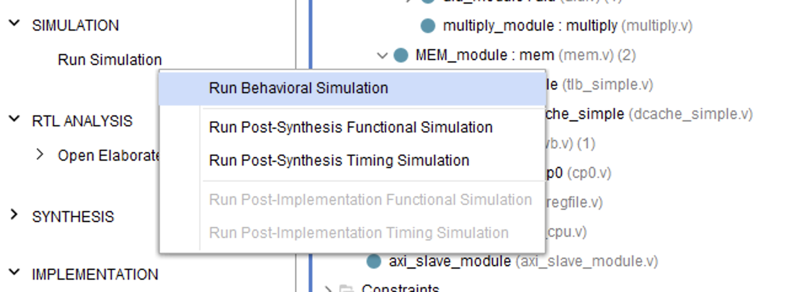
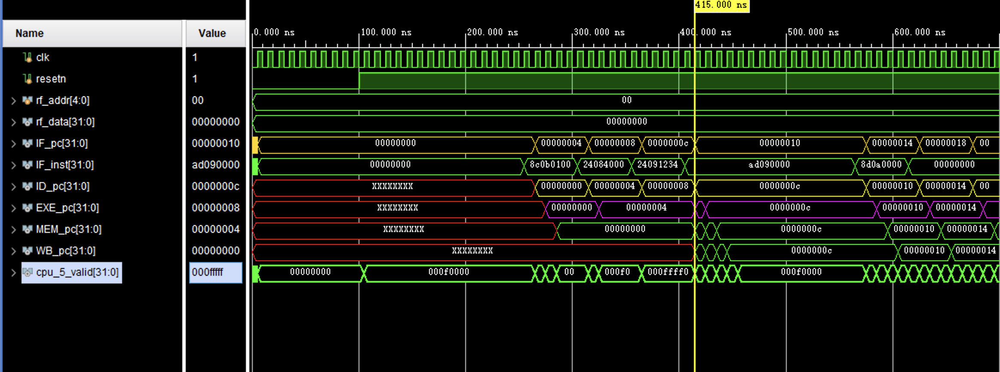

# Pipeline CPU on FPGA

Switch the language:

- English：[README.en.md](README.en.md)

## 声明


- 一定不要抄袭啊孩子们
- 使用方法见最下面“导入方法”
- 目前版本无需 Vivado IP 核
- 除了最终实验报告，其余报告在 `bagao` 分支（不是 `baogao` 分支）
- 帮忙点个 star（如果可以）

## 项目简介

一个基于 Verilog 的五级流水 MIPS-like CPU，主要模块包括：

- `fetch / decode / exe / mem / wb` 五级流水
- `regfile`、`alu`、`multiply`、`cp0` 等基础功能部件
- 顶层 `top` 负责把 CPU、AXI 接口、外设等连接在一起，方便在 FPGA 上综合和调试

## 项目文件组成（tree）

```text
.
├── adder.v
├── alu.v
├── AXI
│   ├── AXI_FULL_M_module.v
│   └── axi_slave_module.v
├── bypass_unit.v
├── cp0.v
├── data_ram.v
├── dcache_simple.v
├── decode.v
├── exe.v
├── fetch.v
├── icache_simple.v
├── inst_rom.v
├── mem.v
├── multiply.v
├── pipeline_cpu.v
├── regfile.v
├── testbench.v
├── tlb_simple.v
├── top.v
├── wb.v
└── 最终实验报告
    ├── img
    ├── 梁朝阳 2311561.pdf
    └── 梁朝阳 2311561.tex
```

## CPU 架构图


## 功能模块概览

- [X] 五级流水 CPU
- [X] bypass 前递/旁路单元
- [X] interrupt 异常/中断处理框架（配合 `cp0`）
- [X] AXI 总线接口（`AXI/` 目录）
- [X] TLB
- [X] I-cache & D-cache

## 历程

### bypass

为减少数据相关引入的流水线停顿，实现了前递/旁路单元

### interrupt

支持基本的异常/中断处理框架（配合 `cp0` 模块）

### AXI

针对 FPGA 外设/存储器，提供 AXI 总线接口模块（在 `AXI/` 目录）

### TLB & cache

实现了 TLB 和 cache

---

## 导入方法

发现一个大问题是我之前把所有历史的代码也保留了，导致大家不知道导入什么，就导致很多人跑不出来，但是代码本身没有问题（或者问题不大，如果有人发现有bug也可以直接联系我）。我现在把所有历史代码都删了，最后只需要导入下面这些：

1. 在 Vivado 中导入以下图片以参考：

 


之后运行仿真：

 


仿真结果示例，前面的X属于正常现象：

 

注意：取到的指令后面就是全是0，我好像一共就写了几条指令进去，不是错了。

```verilog
// AXI/axi_slave_module.v
    for(j = 0; j < C_S_RAM_DEPTH; j = j + 1) begin
        case(j)
            // D$ miss: lw $t3, 0x0100($zero)
            0:  ram[j] = 32'h8C0B0100;
            // TLB miss setup: addiu $t0, $zero, 0x4000
            1:  ram[j] = 32'h24084000;
            // data for store: addiu $t1, $zero, 0x1234
            2:  ram[j] = 32'h24091234;
            // TLBS: sw $t1, 0($t0)
            3:  ram[j] = 32'hAD090000;
            // TLBL: lw $t2, 0($t0)
            4:  ram[j] = 32'h8D0A0000;
            default: ram[j] = 32'h00000000; // nop
        endcase
    end
```

---


Mail：budongjishubu@gmail.com
Class of 2023, Cryptography Science, Nankai University
