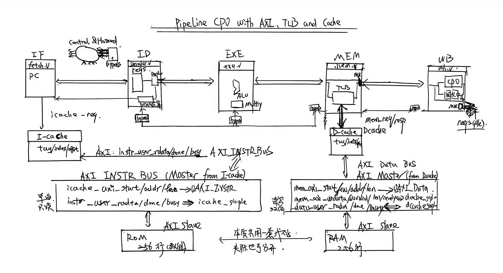

# Pipeline CPU on FPGA 

切换语言 / Switch the language:
- 中文：[README.zh-CN.md](README.zh-CN.md)


## Notes
- No plagiarism — for learning and reference only.
- This version does not require Vivado IP cores.
- Reports (except the final one) are on branch `bagao` (not `baogao`).
- If this helps, a star is appreciated.

## Overview
A 5-stage pipelined, MIPS-like CPU written in Verilog. Key modules include:
- The 5 pipeline stages: `fetch / decode / exe / mem / wb`
- Core functional units: `regfile`, `alu`, `multiply`, `cp0`, etc.
- Top-level `top` integrates CPU + AXI + peripherals for FPGA synthesis/debug

## Project Layout (tree)
```text
.
├── .vscode
│   └── settings.json
├── AXI
│   ├── AXI_FULL_M_module.v
│   └── axi_slave_module.v
├── CPU设计图.jpg （Architecture Diagram）
├── README.md
├── adder.v
├── alu.v
├── bypass_unit.v
├── cp0.v
├── data_ram.v
├── dcache_simple.v
├── decode.v
├── display
│   ├── lcd_module.dcp
│   ├── pipeline_cpu.xdc
│   └── pipeline_cpu_display.v
├── exe.v
├── fetch.v
├── icache_simple.v
├── inst_rom.v
├── mem.v
├── multiply.v
├── pipeline_cpu.v
├── regfile.v
├── testbench.v
├── tlb_simple.v
├── top.v
├── wb.v
└── 最终实验报告 （Final Report）
    ├── img （Images）
    ├── simkai.ttf （Font）
    ├── style （Style）
    ├── 梁朝阳 2311561.pdf （PDF）
    └── 梁朝阳 2311561.tex （LaTeX）
```

## Architecture


## Features
- [x] 5-stage pipelined CPU
- [x] Forwarding (bypass) unit
- [x] Exception & interrupt framework (with `cp0`)
- [x] AXI bus interface (see `AXI/`)
- [x] TLB
- [x] I-cache & D-cache

## Milestones

### bypass
Implemented forwarding/bypass to reduce stalls caused by data hazards.

### interrupt
Added a basic exception/interrupt handling framework (with `cp0`).

### AXI
Provided AXI bus interface modules for FPGA peripherals/memory (in `AXI/`).

### TLB & cache
Implemented TLB and caches.

---

Copyright (c) 2025 Zhaoyang-Liang. All rights reserved.


